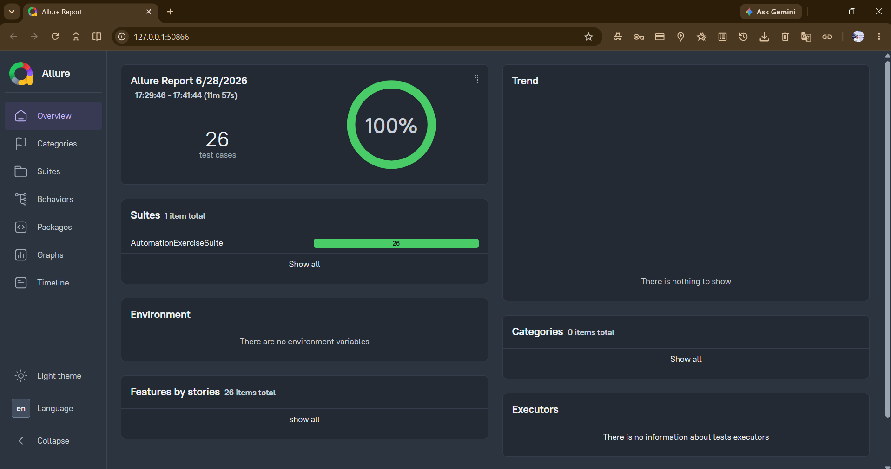

# 🚀 Automation Exercise - UI Test Automation Framework

A scalable and maintainable UI Test Automation Framework developed for the Automation Exercise e-commerce website using Java, Selenium WebDriver, TestNG, Maven, and the Page Object Model (POM).

The framework was designed following automation testing best practices, emphasizing maintainability, reusability, scalability, and clean architecture. It automates major user journeys while providing reliable execution and comprehensive reporting.

---

# 📋 Project Overview

This project automates the core business workflows of the Automation Exercise website through **26 End-to-End UI Test Cases**.

---

# ✅ Project Highlights

✔ 26 Automated End-to-End Test Cases  
✔ 100% Test Pass Rate  
✔ Page Object Model (POM) Design Pattern  
✔ JSON-Based Test Data Management  
✔ TestNG XML Suite Execution  
✔ Maven Build & Dependency Management  
✔ Interactive Allure Reports  
✔ Extent Reports Integration  
✔ Reusable Selenium Framework  
✔ External Configuration Management

---

# 🧪 Automated Test Scenarios

- User Registration
- Login (Valid & Invalid)
- Logout
- Register with Existing Email
- Contact Us Form
- Test Cases Navigation
- View Products & Product Details
- Search Products
- Homepage Subscription
- Cart Subscription
- Add Products to Cart
- Verify Product Quantity
- Register While Checkout
- Register Before Checkout
- Login Before Checkout
- Remove Products from Cart
- View Category Products
- View Brand Products
- Search Products & Verify Cart After Login
- Add Product Review
- Add Recommended Products to Cart
- Verify Address Details
- Download Invoice
- Scroll Up Using Arrow Button
- Scroll Up Without Arrow Button

---

# 🏗 Framework Architecture

```text
src
├── main
│   ├── base
│   ├── framework
│   ├── pages
│   └── utilities
│
├── test
│   ├── base
│   ├── listeners
│   └── tests
│
└── resources
    ├── config.properties
    └── testdata
```

---

# 📸 Project Screenshots

## Project Structure


## Allure Report

---

# ⚙ Framework Features

- Reusable Page Objects
- Base Page & Base Test Classes
- Centralized Configuration Management
- JSON Test Data Management
- Custom Selenium Framework Utilities
- Explicit Wait Utilities
- JavaScript Utilities
- Scroll & Click Helpers
- File Upload Utilities
- Extent Report Integration
- Allure Report Integration
- TestNG Listeners
- Clean Project Structure
- Easy Suite Execution

---

# 🛠 Technology Stack

| Technology | Purpose |
|------------|---------|
| Java | Programming Language |
| Selenium WebDriver | UI Automation |
| TestNG | Test Framework |
| Maven | Build Tool |
| Page Object Model (POM) | Design Pattern |
| JSON | Test Data |
| Allure Reports | Reporting |
| Extent Reports | Reporting |
| Git | Version Control |
| Eclipse IDE | Development Environment |

---

# 📊 Test Results

| Metric | Result |
|--------|--------|
| Automated Test Cases | 26 |
| Test Status | ✅ Passed |
| Framework Status | Stable |
| Reporting | Allure + Extent |

---

# ▶️ Run the Project

### Clone Repository

```bash
git clone https://github.com/muhammed-elgarf/automation-exercise-ui-automation.git
```

### Install Dependencies

```bash
mvn clean install
```

### Execute Test Suite

```bash
mvn test
```

or run

```text
testng.xml
```

---

# 📁 Test Data

The framework stores test data externally using JSON files.

Examples include:

- register.json
- login.json
- products.json
- payment.json
- contact.json
- review.json
- subscription.json
- existingUser.json

---

# 📈 Reports

After execution, the framework generates:

- ✅ Allure Reports
- ✅ Extent Reports
- ✅ TestNG Reports

---

# 📂 Project Links

### 🔗 GitHub Repository

https://github.com/muhammed-elgarf/automation-exercise-ui-automation

### 📁 Google Drive (Project Files & Reports)

https://drive.google.com/drive/folders/19auvcljwrjh1igceTDl1Kux9RYTHGedZ?usp=drive_link

### 💼 LinkedIn

https://www.linkedin.com/in/muhammed-el-garf-798bb432a/

---

# 👨‍💻 Author

**Muhammed Raafat ELGarf**

Software Testing Engineer

⭐ If you found this project helpful, consider giving it a Star.
